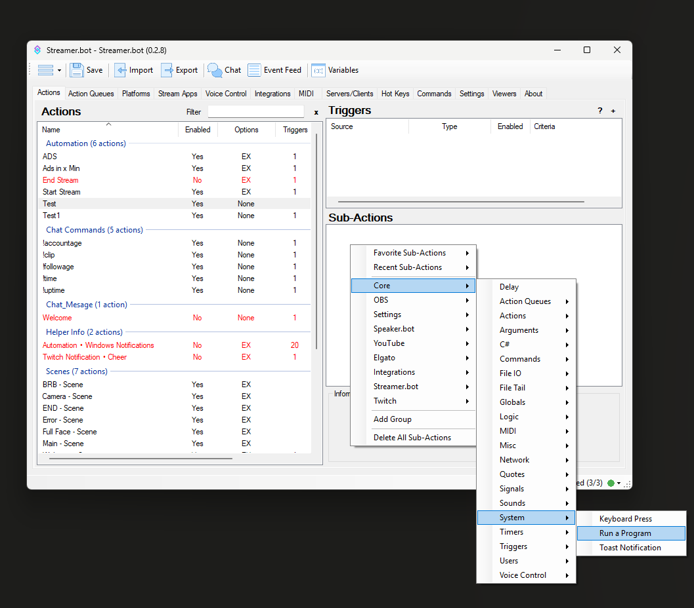
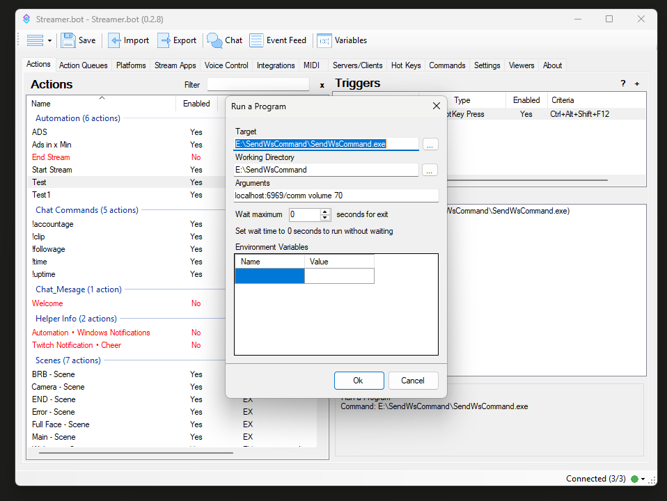
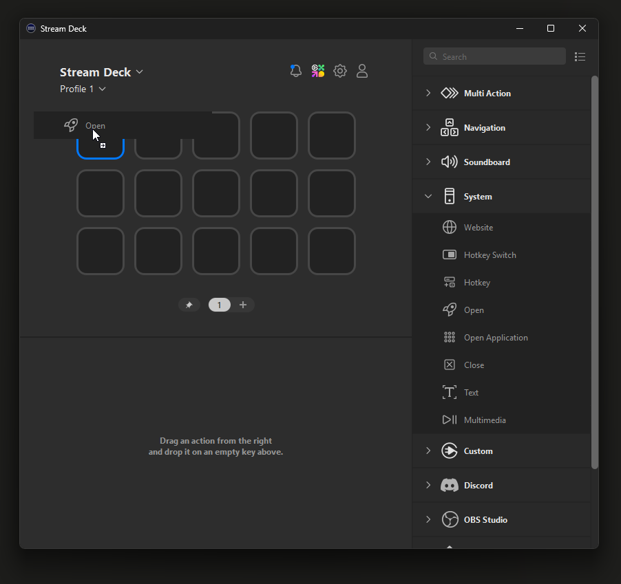
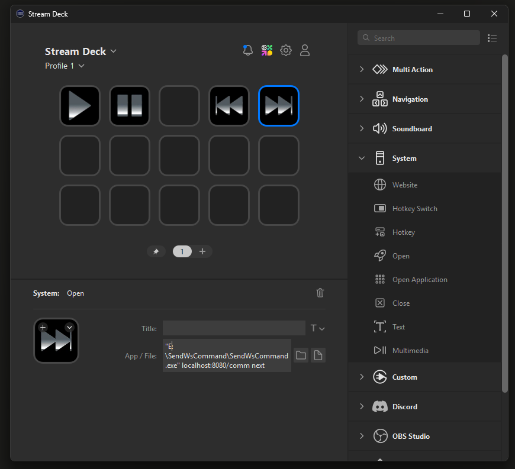

# SendWsCommand - User Guide

A lightweight, portable command-line utility for sending JSON-formatted WebSocket messages to a server. Designed as a companion tool for the MP3 Player project, it enables remote control via automation platforms like Streamer.bot or Stream Deck.

---

## 1. Introduction

`SendWsCommand` is a helper tool created to allow automation tools to control the MP3 Player remotely. It sends commands in JSON format to a WebSocket server, making it ideal for streamers and power users.

---

## 2. System Requirements

- Windows 10 or 11 (64-bit)
- No external dependencies
- .NET **not** required (self-contained executable)

---

## 3. Usage Syntax

```bash
SendWsCommand.exe <WebSocketServerURL> <Command> [Value]
```

### Parameters


- `<WebSocketServerURL>`: The WebSocket server address including port and path (e.g., `localhost:8080/comm`). While localhost is commonly used when both tools run on the same machine (recommended), any valid network-accessible address can be used.
- `<Command>`: The command name (e.g., `play`, `pause`, `next`, `volume`)
- `[Value]`: (Optional) The value to accompany the command (e.g., `60` for volume)

### Example Commands

```bash
SendWsCommand.exe localhost:8080/comm next
SendWsCommand.exe localhost:8080/comm volume 45
```

### Example Output Messages

- `{"Command": "next"}`
- `{"Command": "volume", "Value": "45"}`

---

## 4. Integration Examples

### A. Streamer.bot Integration

1. Open **Streamer.bot**
2. Go to the **Actions** tab
3. Create a new action (e.g., *Next Track*)
4. Add a **Sub-Action** → *Execute Program*
5. Configure the sub-action:
   - **Program**: `C:\Path\To\SendWsCommand.exe`
   - **Arguments**: `localhost:8080/comm next`



6. Assign the action to a hotkey, Twitch command, or event trigger.

---

### B. Stream Deck Integration

#### Method 1: Through Streamer.bot

- Map the Streamer.bot action (above) to a Stream Deck button.

#### Method 2: Using BarRaider's Stream Deck Tools

1. Install BarRaider's **System plugin**
2. Add a **Run** or **Advanced Launcher** action
3. Configure it:
   - **Executable Path**: `SendWsCommand.exe`
   - **Arguments**: `localhost:8080/comm volume 70`



---

## 5. Troubleshooting

| Issue                         | Solution                                                                                                                                                                                                                   |
| ----------------------------- | -------------------------------------------------------------------------------------------------------------------------------------------------------------------------------------------------------------------------- |
| `WebSocket connection failed` | Ensure the MP3 player is running and accepting connections on the specified address. Using localhost is recommended when both the MP3 player and this tool run on the same machine,										 |
|								| which is the most secure and reliable setup. However, the tool can connect to any reachable WebSocket server, including over LAN or a trusted external IP, if needed. Avoid exposing open WebSocket ports to the internet. |
| `No action taken`             | The utility does not show errors by default. It is a Windows executable with a hidden console and no UI. Ensure arguments are correct and the MP3 Player is running.                                                       |
| `Firewall blocking`           | Although unlikely when using `localhost`, ensure that the MP3 player and this tool are not blocked by security software.    
---

## 6. About the Tool

- **Size**: \~12MB trimmed executable
- **Runtime**: Self-contained (no .NET runtime needed)
- **Portability**: Can run from any folder or USB drive
- **License**: [To be added if open source]

---

## 7. Version Info

- Current Version: 1.0.0
- Last Updated: July 2025

For updates, visit the MP3 Player project site or repository.

